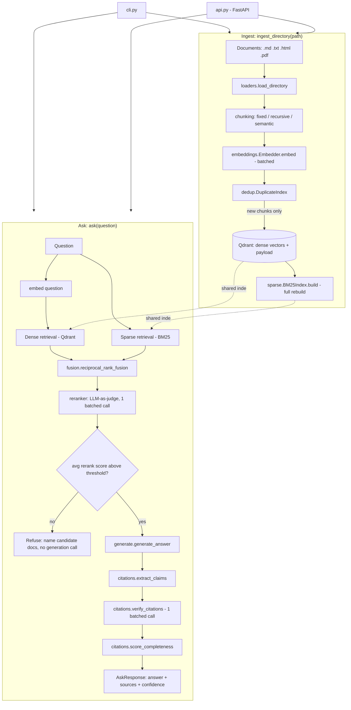

# architecture.md — RAG Pipeline with Hybrid Search Over Internal Docs

## App flow

There is no dedicated frontend yet — the "user entry" is either the CLI or
an HTTP call to the FastAPI service. Two distinct flows exist: **ingest**
and **ask**.

### Ingest flow (`python cli.py ingest <path>` or `POST /v1/ingest`)

1. User points the system at a directory of documents (e.g. `sample_docs/`).
2. `ingestion/loaders.load_directory` walks the directory and loads every
   supported file (`.md`, `.txt`, `.html`, `.pdf`) into a normalized
   `RawDocument` (plaintext + metadata).
3. `pipeline.RAGPipeline._chunk_document` runs the configured chunking
   strategy (`fixed` / `recursive` / `semantic`, set via `CHUNK_STRATEGY`)
   on each document, producing `Chunk` objects.
4. All chunk texts are embedded in one batched call
   (`retrieval/embeddings.py`, batches of 128).
5. `ingestion/dedup.DuplicateIndex` is seeded with every embedding already
   in Qdrant, then filters the new batch — chunks that are near-duplicates
   (cosine similarity ≥ 0.95) of anything already indexed are dropped.
6. Surviving chunks + embeddings are upserted into Qdrant
   (`retrieval/vector_store.py`).
7. The BM25 sparse index is rebuilt from scratch by scrolling the entire
   Qdrant collection (`retrieval/sparse.py`) — this keeps dense and sparse
   indexes from ever drifting out of sync, at the cost of a full rebuild on
   every ingest.
8. A summary (`documents`, `chunks_created`, `chunks_indexed`,
   `duplicates_skipped`) is returned to the caller.

### Ask flow (`python cli.py ask "<question>"` or `POST /v1/ask`)

1. User submits a natural-language question.
2. The question is embedded (1 OpenAI embedding call).
3. **Dense retrieval**: Qdrant returns the top-`dense_top_k` (default 10)
   chunks by cosine similarity.
4. **Sparse retrieval**: BM25 returns the top-`sparse_top_k` (default 10)
   chunks by keyword score.
5. **Fusion**: `retrieval/fusion.reciprocal_rank_fusion` merges both
   ranked lists into one, weighted 0.7 dense / 0.3 sparse by default.
6. The top `rerank_candidate_pool` (default 20) fused candidates go to the
   **reranker**: one batched chat-completion call scores each candidate's
   relevance to the actual question 0–10; the top `final_top_k` (default 5)
   survive.
7. **Confidence gate**: if the reranked results are empty or the average
   rerank score is below `min_retrieval_confidence` (default 0.35), the
   pipeline **refuses** — it returns a message naming which source
   documents might be worth checking manually, and skips steps 8–11
   entirely (no generation call is made on a low-confidence retrieval).
8. **Generation**: the surviving chunks are numbered into context blocks
   and passed to the chat model with a system prompt that requires
   bracketed citations for every claim (`generation/prompts.py`,
   `generation/generate.py`).
9. **Citation extraction**: the answer is split into sentences and each
   sentence's `[n]` citation markers are parsed out
   (`generation/citations.extract_claims`).
10. **Citation verification**: every claim that cites something is checked
    against its cited source passage via one batched LLM-as-judge call —
    does the passage actually support the claim?
11. **Completeness scoring**: a separate LLM call rates 0–1 whether the
    answer addressed everything the context allowed it to.
12. **Composite confidence** = average of (retrieval confidence, citation
    coverage, completeness), returned alongside the answer and the list of
    sources actually used.

## System architecture



**Explanation**: `cli.py` and `api.py` are the only two entry points, and
both are thin — all logic lives in `pipeline.RAGPipeline`, so a future
Streamlit/React frontend (Phase 5) would be a third thin entry point over
the same class, not a rewrite. Qdrant is the single source of truth for
chunk data; BM25 is a derived, in-memory index rebuilt from it, which is
why there's no separate write path that could let the two drift apart.

## Folder and file structure

```
rag-pipeline/
├── config.py              # Settings dataclass — every tunable in one place
├── pipeline.py             # RAGPipeline: orchestrates ingest_directory() and ask()
├── cli.py                  # CLI entry point (argparse: ingest, ask)
├── api.py                  # FastAPI entry point (/v1/ask, /v1/ingest, /v1/documents)
│
├── ingestion/              # Everything before a chunk has an embedding
│   ├── loaders.py          #   multi-format file -> RawDocument (plaintext + metadata)
│   ├── chunking.py         #   RawDocument -> list[Chunk], 3 switchable strategies
│   └── dedup.py            #   near-duplicate detection against the existing index
│
├── retrieval/              # Everything from "question" to "ranked candidate chunks"
│   ├── embeddings.py       #   OpenAI embedding wrapper, batched
│   ├── vector_store.py     #   Qdrant dense storage/query (embedded or remote)
│   ├── sparse.py           #   BM25 keyword index
│   ├── fusion.py           #   Reciprocal Rank Fusion of dense + sparse results
│   └── reranker.py         #   LLM-as-judge rerank of the fused candidate pool
│
├── generation/             # Everything from "ranked chunks" to "verified answer"
│   ├── prompts.py          #   grounded-generation system/user prompt templates
│   ├── generate.py         #   the actual chat-completion call for the answer
│   └── citations.py        #   claim extraction, citation verification, confidence scoring
│
├── sample_docs/            # Fictional "Aegis API" docs used to test/demo the pipeline
│   ├── authentication.md
│   ├── deployment.md
│   └── error_codes.md
│
├── tests/
│   └── test_pipeline_smoke.py  # full ingest->ask flow w/ OpenAI client mocked deterministically
│
├── requirements.txt
├── .env.example
├── .gitignore
├── README.md
├── PRD.md / TRD.md / architecture.md / rules.md / phases.md / design.md
└── qdrant_data/            # (gitignored) embedded Qdrant's on-disk storage, created at runtime
```

Each top-level Python folder maps to one stage of the pipeline
(`ingestion` → `retrieval` → `generation`), matching the order data
actually flows through `pipeline.py` — there's no folder organized by
"models" or "utils" that would force jumping between unrelated stages to
trace one request.

## Tech stack summary

| Layer | Choice |
|---|---|
| Language | Python 3.11+ |
| API | FastAPI + Pydantic |
| Dense retrieval | Qdrant (embedded by default; `QDRANT_URL` for a real server) |
| Sparse retrieval | `rank_bm25` (BM25Okapi), in-memory, rebuilt per ingest |
| Embeddings | OpenAI `text-embedding-3-small` |
| Generation / judging | OpenAI `gpt-4o` (configurable via `CHAT_MODEL`) |
| Hosting | None yet — dev/local only |

See `TRD.md` for exact versions and full rationale.

## Data flow between frontend, backend, and database

There is no dedicated frontend (Phase 5's dashboard is unbuilt), so this
describes CLI/HTTP client ↔ `RAGPipeline` ↔ Qdrant:

- **Client → backend**: the CLI calls `RAGPipeline` methods directly
  in-process (no network hop); the API layer (`api.py`) accepts JSON over
  HTTP (`AskRequest{question}`, `IngestRequest{path}`) and calls the exact
  same `RAGPipeline` methods — there is no logic duplicated between the
  two front ends.
- **Backend → OpenAI**: outbound HTTPS calls for embeddings (ingest +
  query) and chat completions (rerank, generate, verify, score) — see TRD
  for exact call counts per operation.
- **Backend → Qdrant**: embedded mode is an in-process library call (no
  network), writing to a local on-disk folder (`QDRANT_PATH`); remote mode
  (`QDRANT_URL` set) would make this an HTTP/gRPC call instead — the
  `QdrantVectorStore` interface in `retrieval/vector_store.py` is identical
  either way, so nothing else in the codebase needs to know which mode is
  active.
- **Backend → BM25 (in-memory)**: not a database at all — it's a Python
  object living in `RAGPipeline.bm25`, rebuilt from Qdrant on every ingest
  and on every process start (`RAGPipeline.__init__` calls
  `_rebuild_sparse_index()` so a fresh process picks up whatever was
  indexed by a previous run).
- **Backend → client (response)**: `AskResponse` (question, answer,
  sources, confidence, refused/refusal_reason) — `api.py` returns
  `response.__dict__` directly, so the JSON shape returned by the API is
  exactly the dataclass shape used internally, with no separate
  serialization schema to keep in sync.
